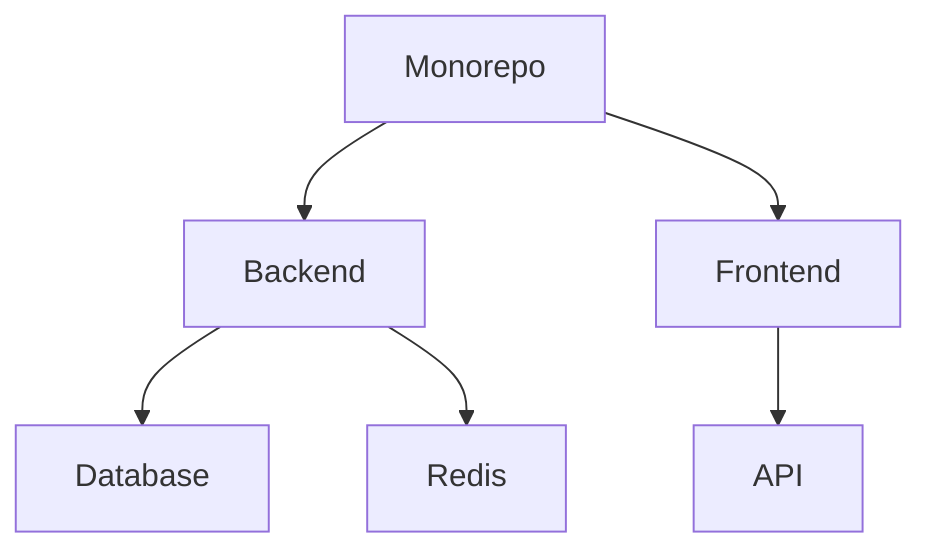

# API Zenith Documentation

## Monorepo Architecture Diagram



## API Endpoint Reference

### User Endpoints

- **GET /api/v1/users**
  - Description: Retrieve a list of users.
  - Response: 
    ```json
    [
      {
        "id": "uuid",
        "email": "user@example.com",
        "created_at": "2021-01-01T00:00:00Z",
        "updated_at": "2021-01-01T00:00:00Z"
      }
    ]
    ```

- **GET /api/v1/users/{id}**
  - Description: Retrieve a specific user by ID.
  - Response: 
    ```json
    {
      "id": "uuid",
      "email": "user@example.com",
      "created_at": "2021-01-01T00:00:00Z",
      "updated_at": "2021-01-01T00:00:00Z"
    }
    ```

- **POST /api/v1/users**
  - Description: Create a new user.
  - Request Body: 
    ```json
    {
      "email": "user@example.com",
      "hashed_password": "hashed_password"
    }
    ```
  - Response: 
    ```json
    {
      "id": "uuid",
      "email": "user@example.com",
      "created_at": "2021-01-01T00:00:00Z",
      "updated_at": "2021-01-01T00:00:00Z"
    }
    ```

- **PUT /api/v1/users/{id}**
  - Description: Update an existing user.
  - Request Body: 
    ```json
    {
      "email": "user@example.com",
      "hashed_password": "new_hashed_password"
    }
    ```
  - Response: 
    ```json
    {
      "id": "uuid",
      "email": "user@example.com",
      "created_at": "2021-01-01T00:00:00Z",
      "updated_at": "2021-01-01T00:00:00Z"
    }
    ```

- **DELETE /api/v1/users/{id}**
  - Description: Delete a user by ID.
  - Response: 
    ```json
    {
      "message": "User deleted successfully."
    }
    ```

### Product Endpoints

- **GET /api/v1/products**
  - Description: Retrieve a list of products.
  - Response: 
    ```json
    [
      {
        "id": "uuid",
        "name": "Product Name",
        "price": 100.0,
        "inventory_count": 10,
        "created_at": "2021-01-01T00:00:00Z",
        "updated_at": "2021-01-01T00:00:00Z"
      }
    ]
    ```

- **GET /api/v1/products/{id}**
  - Description: Retrieve a specific product by ID.
  - Response: 
    ```json
    {
      "id": "uuid",
      "name": "Product Name",
      "price": 100.0,
      "inventory_count": 10,
      "created_at": "2021-01-01T00:00:00Z",
      "updated_at": "2021-01-01T00:00:00Z"
    }
    ```

- **POST /api/v1/products**
  - Description: Create a new product.
  - Request Body: 
    ```json
    {
      "name": "Product Name",
      "price": 100.0,
      "inventory_count": 10
    }
    ```
  - Response: 
    ```json
    {
      "id": "uuid",
      "name": "Product Name",
      "price": 100.0,
      "inventory_count": 10,
      "created_at": "2021-01-01T00:00:00Z",
      "updated_at": "2021-01-01T00:00:00Z"
    }
    ```

- **PUT /api/v1/products/{id}**
  - Description: Update an existing product.
  - Request Body: 
    ```json
    {
      "name": "Updated Product Name",
      "price": 150.0,
      "inventory_count": 5
    }
    ```
  - Response: 
    ```json
    {
      "id": "uuid",
      "name": "Updated Product Name",
      "price": 150.0,
      "inventory_count": 5,
      "created_at": "2021-01-01T00:00:00Z",
      "updated_at": "2021-01-01T00:00:00Z"
    }
    ```

- **DELETE /api/v1/products/{id}**
  - Description: Delete a product by ID.
  - Response: 
    ```json
    {
      "message": "Product deleted successfully."
    }
    ```

## Development Environment Setup Guide

### Prerequisites

- Docker
- Docker Compose
- Node.js (v16.x)
- Python (v3.9.x)
- PostgreSQL (v13.x)
- Redis (v6.x)

### Setup Steps

1. Clone the repository:
   ```sh
   git clone https://github.com/sisovin/api-zenith.git
   cd api-zenith
   ```

2. Set up the backend environment:
   ```sh
   cd packages/backend
   cp .env.example .env
   ```

3. Set up the frontend environment:
   ```sh
   cd ../frontend
   cp .env.example .env
   ```

4. Start the development environment:
   ```sh
   docker-compose up --build
   ```

5. Access the application:
   - Backend: http://localhost:5000
   - Frontend: http://localhost:3000

## Contribution Guidelines

### How to Contribute

1. Fork the repository.
2. Create a new branch for your feature or bugfix:
   ```sh
   git checkout -b feature-name
   ```
3. Make your changes.
4. Commit your changes:
   ```sh
   git commit -m "Description of your changes"
   ```
5. Push to your branch:
   ```sh
   git push origin feature-name
   ```
6. Create a pull request.

### Code Style

- Follow the existing code style.
- Use Prettier and ESLint for code formatting and linting.
- Write clear and concise commit messages.

### Reporting Issues

- Use the GitHub issue tracker to report bugs or request features.
- Provide as much detail as possible when reporting issues.

## OS-Specific Instructions

<details>
<summary>Windows</summary>

### Prerequisites

- Docker Desktop
- Node.js (v16.x)
- Python (v3.9.x)
- PostgreSQL (v13.x)
- Redis (v6.x)

### Setup Steps

1. Clone the repository:
   ```sh
   git clone https://github.com/sisovin/api-zenith.git
   cd api-zenith
   ```

2. Set up the backend environment:
   ```sh
   cd packages/backend
   copy .env.example .env
   ```

3. Set up the frontend environment:
   ```sh
   cd ../frontend
   copy .env.example .env
   ```

4. Start the development environment:
   ```sh
   docker-compose up --build
   ```

5. Access the application:
   - Backend: http://localhost:5000
   - Frontend: http://localhost:3000

</details>

<details>
<summary>macOS</summary>

### Prerequisites

- Docker
- Docker Compose
- Node.js (v16.x)
- Python (v3.9.x)
- PostgreSQL (v13.x)
- Redis (v6.x)

### Setup Steps

1. Clone the repository:
   ```sh
   git clone https://github.com/sisovin/api-zenith.git
   cd api-zenith
   ```

2. Set up the backend environment:
   ```sh
   cd packages/backend
   cp .env.example .env
   ```

3. Set up the frontend environment:
   ```sh
   cd ../frontend
   cp .env.example .env
   ```

4. Start the development environment:
   ```sh
   docker-compose up --build
   ```

5. Access the application:
   - Backend: http://localhost:5000
   - Frontend: http://localhost:3000

</details>

<details>
<summary>Linux</summary>

### Prerequisites

- Docker
- Docker Compose
- Node.js (v16.x)
- Python (v3.9.x)
- PostgreSQL (v13.x)
- Redis (v6.x)

### Setup Steps

1. Clone the repository:
   ```sh
   git clone https://github.com/sisovin/api-zenith.git
   cd api-zenith
   ```

2. Set up the backend environment:
   ```sh
   cd packages/backend
   cp .env.example .env
   ```

3. Set up the frontend environment:
   ```sh
   cd ../frontend
   cp .env.example .env
   ```

4. Start the development environment:
   ```sh
   docker-compose up --build
   ```

5. Access the application:
   - Backend: http://localhost:5000
   - Frontend: http://localhost:3000

</details>
