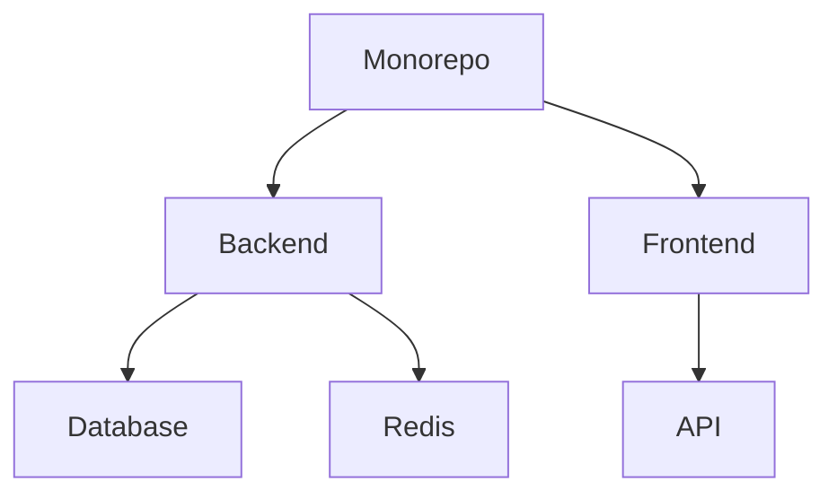

# API Zenith Documentation

## Project Overview

**API Zenith** is a robust and scalable API platform designed for managing users and products. Built with modern technologies and a monorepo architecture, it offers high performance and reliability. This project is aimed at simplifying API development while maintaining flexibility and scalability.

### Key Features
- **User Management**: Create, update, retrieve, and delete user accounts.
- **Product Management**: Manage product inventory with ease.
- **Scalable Architecture**: Monorepo structure suitable for large-scale development.
- **Modern Technologies**: Python, TypeScript, PostgreSQL, Redis, and Docker integration.

---

## Table of Contents

1. [Project Overview](#project-overview)
2. [Monorepo Architecture](#monorepo-architecture)
   - [Architecture Diagram](#architecture-diagram)
   - [Component Details](#component-details)
3. [API Endpoint Reference](#api-endpoint-reference)
   - [User Endpoints](#user-endpoints)
   - [Product Endpoints](#product-endpoints)
4. [Authentication](#authentication)
5. [Development Environment Setup Guide](#development-environment-setup-guide)
   - [Prerequisites](#prerequisites)
   - [Setup Steps](#setup-steps)
6. [Contribution Guidelines](#contribution-guidelines)
7. [Codebase Structure](#codebase-structure)
8. [FAQ](#faq)
9. [Troubleshooting](#troubleshooting)
10. [License](#license)

---

## Monorepo Architecture

### Architecture Diagram


### Component Details
- **Backend**: Manages API logic and connects to the database and Redis.
- **Frontend**: Provides the user interface for interacting with the API.
- **Database**: PostgreSQL database for persistent storage.
- **Redis**: In-memory store for caching and session management.

---

## API Endpoint Reference

### User Endpoints

- **GET /api/v1/users**  
  Retrieve a list of users.
  ```json
  [
    {
      "id": "uuid",
      "email": "user@example.com",
      "created_at": "2021-01-01T00:00:00Z",
      "updated_at": "2021-01-01T00:00:00Z"
    }
  ]
  ```

- **GET /api/v1/users/{id}**  
  Retrieve a specific user by ID.  
  Response:  
  ```json
  {
    "id": "uuid",
    "email": "user@example.com",
    "created_at": "2021-01-01T00:00:00Z",
    "updated_at": "2021-01-01T00:00:00Z"
  }
  ```

- **POST /api/v1/users**  
  Create a new user.  
  Request Body:  
  ```json
  {
    "email": "user@example.com",
    "hashed_password": "hashed_password"
  }
  ```

- **PUT /api/v1/users/{id}**  
  Update an existing user.  
  Request Body:  
  ```json
  {
    "email": "user@example.com",
    "hashed_password": "new_hashed_password"
  }
  ```

- **DELETE /api/v1/users/{id}**  
  Delete a user by ID.  
  Response:  
  ```json
  {
    "message": "User deleted successfully."
  }
  ```

### Product Endpoints

- **GET /api/v1/products**  
  Retrieve a list of products.  

- **GET /api/v1/products/{id}**  
  Retrieve a specific product by ID.  

- **POST /api/v1/products**  
  Create a new product.  

- **PUT /api/v1/products/{id}**  
  Update an existing product.  

- **DELETE /api/v1/products/{id}**  
  Delete a product by ID.

---

## Authentication

API Zenith uses **API Key** authentication. Ensure that all requests include a valid API key in the header.

Example:
```http
GET /api/v1/users HTTP/1.1
Authorization: Bearer <your-api-key>
```

---

## Development Environment Setup Guide

### Prerequisites
1. Docker
2. Docker Compose
3. Node.js (v16.x)
4. Python (v3.9.x)
5. PostgreSQL (v13.x)
6. Redis (v6.x)

### Setup Steps
1. Clone the repository:
   ```bash
   git clone https://github.com/sisovin/api-zenith.git
   cd api-zenith
   ```

2. Set up the backend environment:
   ```bash
   cd packages/backend
   cp .env.example .env
   ```

3. Set up the frontend environment:
   ```bash
   cd ../frontend
   cp .env.example .env
   ```

4. Start the development environment:
   ```bash
   docker-compose up --build
   ```

5. Access the application:
   - Backend: [http://localhost:5000](http://localhost:5000)
   - Frontend: [http://localhost:3000](http://localhost:3000)

---

## Contribution Guidelines

### How to Contribute
1. Fork the repository.
2. Create a new branch:
   ```bash
   git checkout -b feature-name
   ```
3. Make your changes and commit:
   ```bash
   git commit -m "Description of changes"
   ```
4. Push to your forked repository:
   ```bash
   git push origin feature-name
   ```
5. Create a pull request on GitHub.

### Code Style
- Use **Prettier** and **ESLint** for JavaScript/TypeScript formatting.
- Follow **PEP 8** for Python code.

---

## Codebase Structure

```
api-zenith/
├── packages/
│   ├── backend/      # Backend code (Python)
│   ├── frontend/     # Frontend code (TypeScript)
├── .github/          # GitHub Actions and templates
├── docker-compose.yml # Docker setup
├── README.md         # Documentation
```

---

## FAQ

**Q**: What is API Zenith?  
**A**: API Zenith is a scalable platform for managing users and products.

**Q**: Where do I report bugs?  
**A**: Use the [GitHub Issues](https://github.com/sisovin/api-zenith/issues) section.

---

## Troubleshooting

- **Docker Issues**: Verify Docker and Docker Compose are installed and running.
- **Database Connection**: Check `.env` configurations for PostgreSQL and Redis.

---

## License

This project is licensed under the MIT License. See the [LICENSE](LICENSE) file for details.
```
